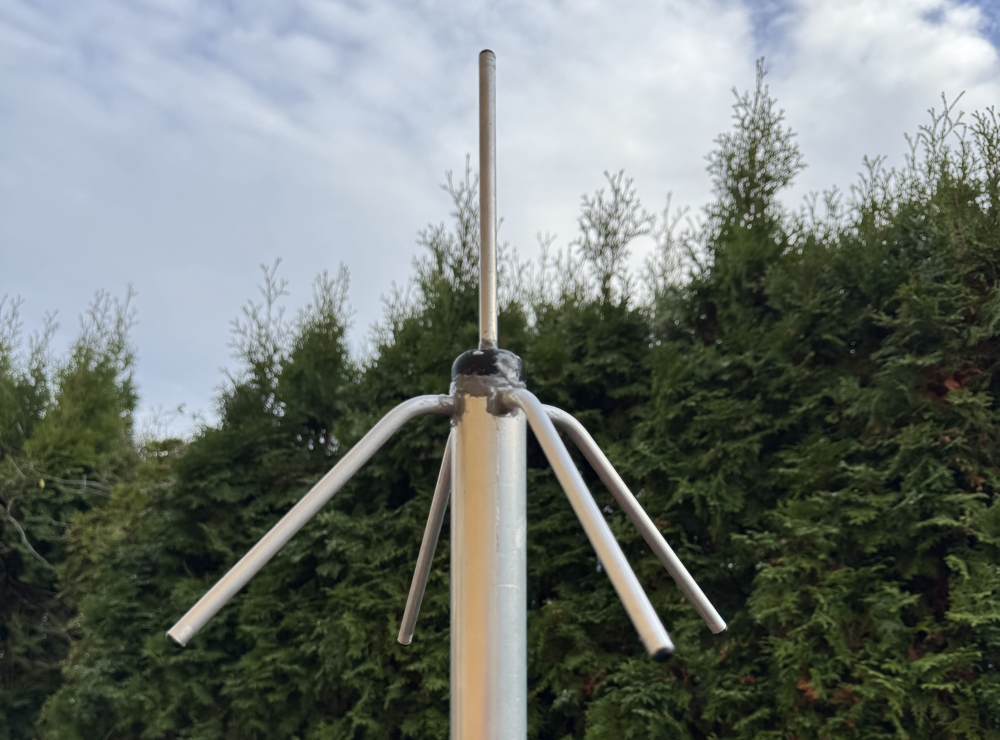
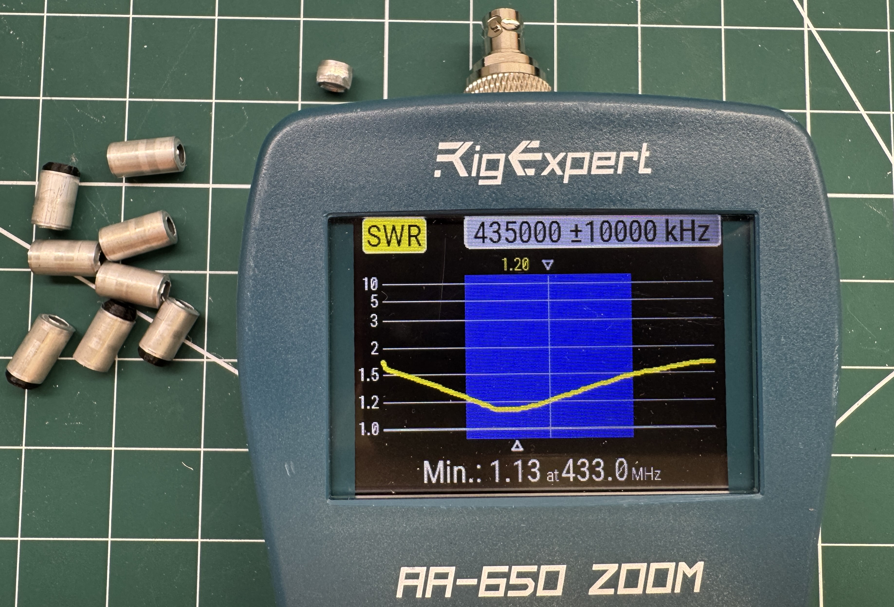
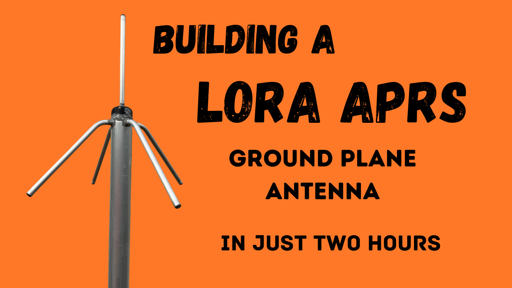

# 433MHz GP Antenna (for LoRa APRS)
A LoRa APRS ground plane antenna you can build just two hours!

**Build video at the bottom of the page!**

Continuing my journey into LoRa APRS it was about time for my iGate / Digipeater to get it's own antenna. So far it's been connected to the X50 I normally use for 2m/70cm FM. After evaluating many potential designs, from a regular vertical dipole to a j-pole, I settled on the venerable ¼λ (quarter wavelength) ground plane antenna. For my use case, this has the perfect combination of a high gain and a high enough WAF (wife acceptance factor). The traditional design usually calls for 4 radials, pointing downward at a 45° (more strictly 42°) angle for the best match to a 50Ω coaxial cable. The dimensions given during the build turned out to be to long, and I ended up cutting 27mm of the radials and 5mm of the vertical element. Thus the finished project, that showed an SWR of less then 1:1.2 at 433.775MHz, was as follows:

**Radiator:** 159mm

**Radials:** 157mm

The design uses 5 different 3D-printed parts. All of these are fully parametric. If you want to used different dimensions, just update the spreadsheet in the FreeCAD design file:

[LoRa APRS Antenna.fcstd](<LoRa APRS Antenna.fcstd>)

## Bill of materials

- 500mm, 35mm Ø aluminium pipe (mast support)
- 5 x 261mm, 8mm Ø  aluminium pipe (elements)
- Aluminium contact paste (optional but recommended)
- 4 x M4x16mm bolts (for attaching the radials)
- M4x8mm bold (for attaching the main radiator)
- 4 x M3x20mm bolts w/washers (for attaching the top cover)
- 2 x M4x12mm set-screws (for securing the main radiator)
- BNC chassis / bulk head connector
- 650mm RG58 Coax
- 3 x Fair-Rite 2661480002 core (for choke, optional but recommended)
- 200mmx12mm Ø clue lined heat shrink tube (for attaching the choke)
- 5 x Aluminium M4 rivet nut insert (like [these](https://www.ebay.com/itm/152075695177))
- 3D printed parts described below
- Beverage of your choice (Kronenbourg 1664 Blanc recommended)

## FreeCAD Source File (if you want to make changes)

[Power-Pole-Volt-Meter.FCStd](<Power-Pole-Volt-Meter.FCStd>)

## Top Insert

[LoRa APRS Antenna-Top-Insert.stl](<LoRa APRS Antenna-Top-Insert.stl>)

## Top Cover

[LoRa APRS Antenna-Top-Cover.stl](<LoRa APRS Antenna-Top-Cover.stl>)

## Bottom Insert

[LoRa APRS Antenna-Bottom-Insert.stl](<LoRa APRS Antenna-Bottom-Insert.stl>)

## Drill Guide

[LoRa APRS Antenna-Drill-Guide.stl](<LoRa APRS Antenna-Drill-Guide.stl>)

## Element Plug

[LoRa APRS Antenna-Element-Plug.stl](<LoRa APRS Antenna-Element-Plug.stl>)

# Build Video

